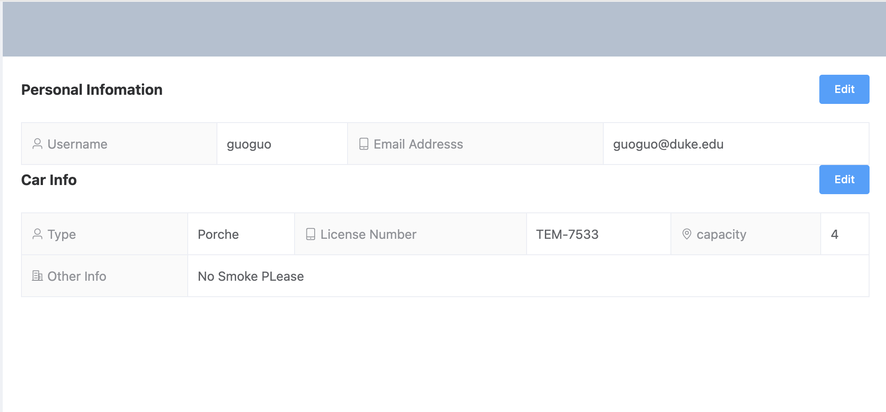
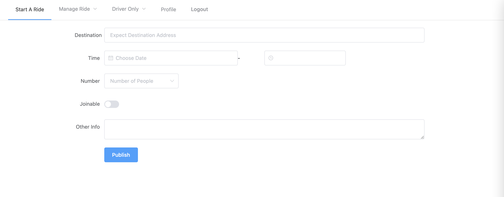
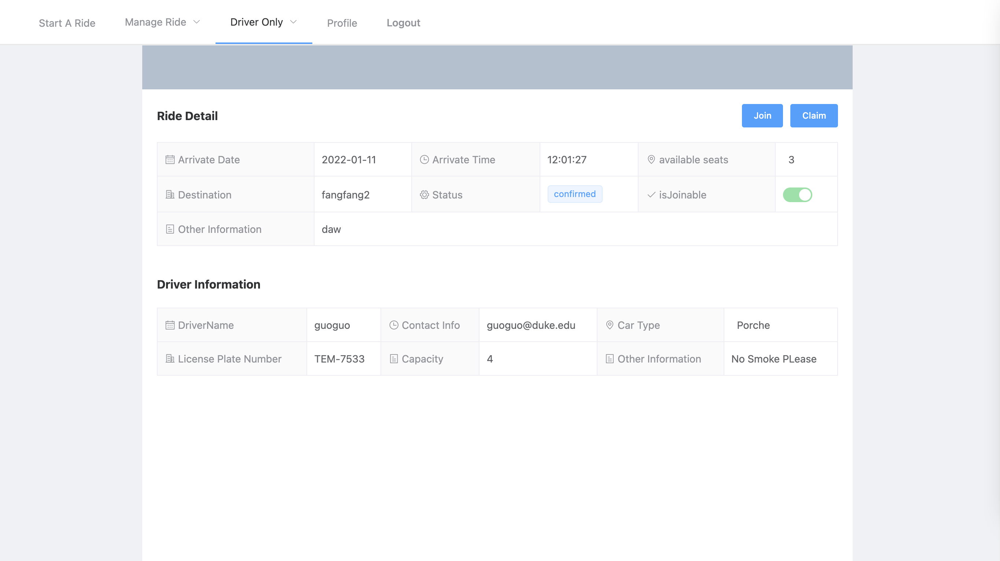

# 1 Introduction

To run this project:
```bash
    docker-compose up
```
To rebuild the container forcely and run you could choose:
`docker-compose up --build` or just build the container without run `docker-compose build`.

also if you want to clear out all test data, enter the web docker, and 
input ```python manage.py flush```
to delete all data we have and start your own

We also has the feature that you can adjust the frontend display by entering the web docker
in `ridefront` folder, input ```yarn run serve```` and open the frontend port

Have Fun :)

# 2 Tech Stack

* FrontEnd:
    * Vue
    * axios
    * ElementUI or Bootstrap

* BackEnd:
    * Django
    * Postgre
    * Nginx
    * Django Rest Framework


# 3 Features We Have


> **Check Your Personal Information**



* you can change  it as you like


> **Start A Ride**




> **Show driver details**


